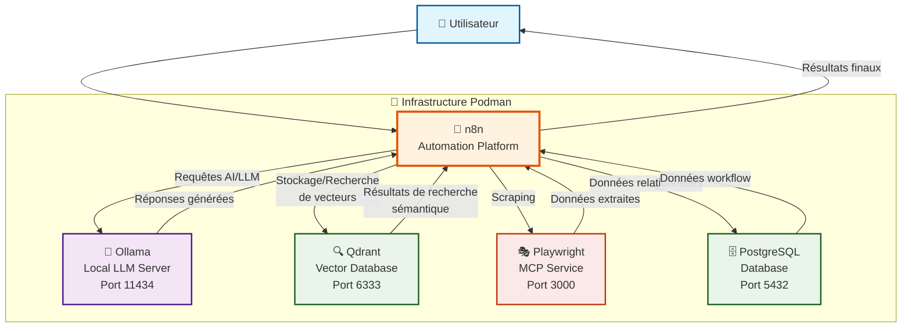
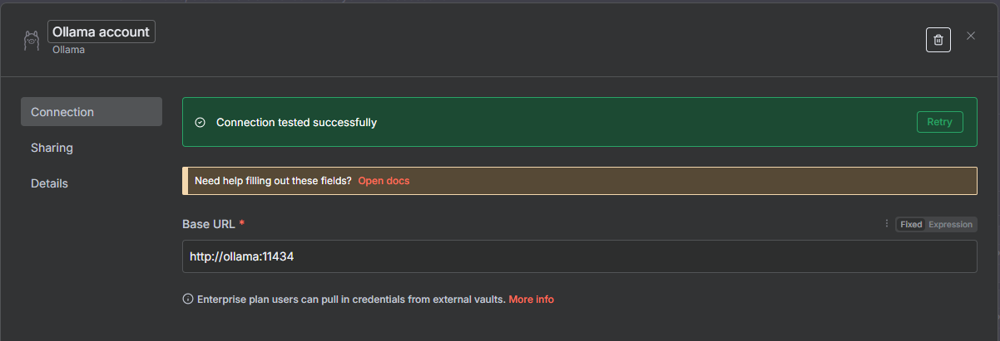
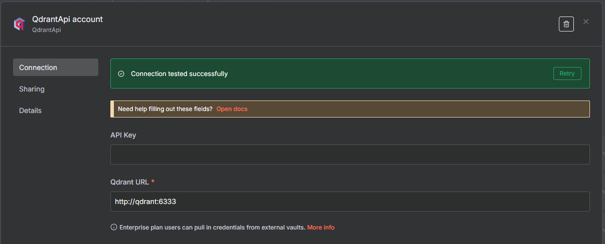

# Playgroud IA n8n Local

Ce projet vous permet de déployer une instance locale de n8n avec PostgreSQL comme base de données, Ollama pour les modeles locaux et qdrant en vector store en utilisant Podman et Podman Compose.

## Architecture



Ce diagramme illustre l'architecture de votre playground IA n8n local :

- **👤 L'utilisateur** interagit avec n8n via l'interface web (port 5678)
- **🔄 n8n** orchestre les workflows et coordonne les interactions avec les autres services
- **🧠 Ollama** fournit les capacités de modèles de langage locaux (LLM) sur le port 11434
- **🔍 Qdrant** gère le stockage et la recherche vectorielle pour les embeddings sur le port 6333
- **🗄️ PostgreSQL** stocke les données relationnelles des workflows et métadonnées sur le port 5432
- **🎭 playwright-mcp** gère le scraping de navigateur sur le port 3000

Tous ces services s'exécutent dans des conteneurs Podman et communiquent via un réseau Docker interne.

## 📋 Prérequis

- **Podman** ou **Docker** avec support des **Dockerfile inline** :
  - Podman Compose : `1.5.0+`
  - Docker Compose : `2.17.0+` (recommandé : `2.20.0+`)


## Talk (slides)

- [n8n AI Playground](https://antobrugnot.github.io/n8n/)

## 🚀 Installation et Démarrage

### 1. Configuration

Avant de démarrer, vous devez **obligatoirement** modifier les mots de passe dans le fichier `.env` :

```bash
# Éditez le fichier .env et changez au minimum :
- POSTGRES_PASSWORD
- POSTGRES_NON_ROOT_PASSWORD  
- N8N_BASIC_AUTH_PASSWORD
- N8N_ENCRYPTION_KEY
```

**Important** : Générez une nouvelle clé de chiffrement avec :
```bash
openssl rand -base64 32
```

### 2. Démarrage des services

```bash
# Démarrer n8n et PostgreSQL
podman compose up -d

# Ou avec docker-compose si vous préférez
docker compose up -d
```

### 3. Vérification du démarrage

```bash
# Vérifier l'état des conteneurs
podman compose ps

# Voir les logs
podman compose logs n8n
podman compose logs postgres
```

## 🌐 Accès à n8n

Une fois démarré, n8n sera accessible à l'adresse :

**http://localhost:5678**

Utilisez les identifiants configurés dans `.env` :
- Utilisateur : `admin` (par défaut)
- Mot de passe : celui défini dans `N8N_BASIC_AUTH_PASSWORD`

## 🛠️ Services inclus

### Services principaux
- **n8n** : Plateforme d'automatisation avec community nodes pré-installés
- **PostgreSQL** : Base de données relationnelle pour n8n
- **Ollama** : Serveur de modèles de langage locaux (LLM)
- **Qdrant** : Base de données vectorielle pour la recherche sémantique
- **playwright-mcp** : Service de scraping via navigateur pour MCP (Model Context Protocol)





### Community Nodes intégrés

Ce projet inclut des **community nodes** pré-installés automatiquement lors du build du conteneur n8n :

- **`n8n-nodes-imap-ai@2.3.9`** : Node IMAP avancé avec fonctionnalités IA
- **`n8n-nodes-mcp@latest`** : Client MCP (Model Context Protocol)

## 🌐 Accès dashboard QDrant

Le dashboard QDrant est accessible à l'adresse :

**http://localhost:6333/dashboard#/welcome**

Pas d'authentification requise.


## 🗄️ Base de données

L'instance utilise PostgreSQL avec les caractéristiques suivantes :
- Base de données : `n8n`
- Port : `5432` (accessible uniquement depuis le conteneur n8n)
- Utilisateur applicatif : `n8n`
- Les données sont persistées dans un volume Docker

## 🧩 Community Nodes disponibles

### Nodes pré-installés
- **IMAP AI** (`n8n-nodes-imap-ai@2.3.9`) : Gestion avancée des emails avec IA
- **MCP Client** (`n8n-nodes-mcp@latest`) : Client pour Model Context Protocol

### Fonctionnalités étendues
Ces community nodes ajoutent des capacités avancées à votre instance n8n :
- Traitement intelligent des emails
- Intégration avec des modèles de contexte
- Automatisation IA personnalisée

## 📁 Structure du projet

```
n8n/
├── docs/                    # Documentation et images
├── .github/                 # Instructions et configurations GitHub
├── workflows/               # Workflows n8n (import automatique)
├── credentials/             # Credentials n8n (import automatique)
├── vector-store-qdrant/     # Stockage des vecteurs Qdrant
├── backups/                 # Sauvegardes de la base de données
├── docker-compose.yml       # Configuration des services
├── .env                     # Variables d'environnement (à personnaliser !)
├── init-data.sh             # Script d'initialisation PostgreSQL
├── import-n8n-data.sh       # Script d'import manuel des données
├── clean.sh                 # Script de nettoyage
├── start.sh                 # Script de démarrage (avec option --import)
├── stop.sh                  # Script d'arrêt
├── setup-ollama.sh          # Script d'installation des modèles Ollama
├── generate-key.sh          # Script de génération de clé de chiffrement
└── README.md                # Ce fichier
```
## Modèles testés

- Ollama : `qwen2.5:3b` (best tool support, multilingual)
- Qdrant : `nomic-embed-text` (embedded for QDrant VectorStore, 768 dimensions, CPU-optimized)
- Vision : `granite-vision-3.2-2b` (image)

## Workflows testés

- Indexation de documents
- Recherche sémantique
- Automatisation de classification des emails
- Chatbot de support client

## 🛠️ Commandes utiles

### Arrêter les services
```bash
podman compose stop
```

### Redémarrer les services
```bash
podman compose restart

# Ou pour rebuilder et redémarrer après ajout de community nodes
podman compose build --no-cache n8n
podman compose up -d
```

### Voir les logs en temps réel
```bash
podman compose logs -f n8n
```

### Supprimer complètement l'installation
```bash
podman compose down -v
```
⚠️ **Attention** : La commande `-v` supprime également les volumes et donc toutes vos données !

### Sauvegarder la base de données
```bash
podman compose exec postgres pg_dump -U n8n n8n > backup_n8n.sql
```

### Restaurer la base de données
```bash
podman compose exec -T postgres psql -U n8n n8n < backup_n8n.sql
```

## 🔧 Configuration avancée

### Community Nodes personnalisés

#### 🔧 Ajout automatique via Dockerfile inline

Le système utilise un **Dockerfile inline** dans le `docker-compose.yml` pour installer automatiquement les community nodes lors du build :

```yaml
n8n:
  build:
    dockerfile_inline: |
      FROM docker.n8n.io/n8nio/n8n
      USER root
      RUN npm install -g n8n-nodes-imap-ai@2.3.9 n8n-nodes-mcp@latest
      USER node
```

**Avantages** :
- ✅ Installation automatique au démarrage
- ✅ Pas de configuration manuelle
- ✅ Reproductibilité garantie
- ✅ Versionning des nodes

#### 📦 Ajouter vos propres community nodes

Pour ajouter d'autres community nodes, modifiez la ligne `RUN npm install` dans le `docker-compose.yml` :

```yaml
# Exemple avec des nodes supplémentaires
RUN npm install -g \
  n8n-nodes-imap-ai@2.3.9 \
  n8n-nodes-mcp@latest \
  n8n-nodes-your-custom-node@1.0.0 \
  another-community-node@latest
```

**⚠️ Important** : Après modification, vous devez rebuilder le conteneur :
```bash
# Forcer le rebuild du conteneur n8n
podman compose build --no-cache n8n
podman compose up -d n8n
```

#### 🔍 Vérification des nodes installés

Pour vérifier que vos community nodes sont bien installés :

```bash
# Se connecter au conteneur n8n
podman compose exec n8n bash

# Lister les packages npm installés globalement
npm list -g --depth=0 | grep n8n-nodes

# Ou vérifier un node spécifique
npm list -g n8n-nodes-imap-ai
```

#### 🆘 Dépannage des community nodes

**Problème** : Community node non visible dans n8n
- Vérifiez que le node est installé : `npm list -g nom-du-node`
- Redémarrez le conteneur : `podman compose restart n8n`
- Vérifiez les logs : `podman compose logs n8n`

**Problème** : Erreur d'installation
- Vérifiez la version du node sur [npm](https://www.npmjs.com/)
- Essayez sans spécifier de version : `@latest`
- Consultez la documentation du community node

### Import automatique des workflows et credentials

Ce projet inclut un système d'import automatique pour vos workflows et credentials :

### 📁 Structure des dossiers
```
workflows/          # Vos fichiers JSON de workflows
├── Customer Support Chat.json
├── Indexation.json
├── Mail.json
└── Search in Index.json

credentials/        # Vos credentials pré-configurés
├── qdrant_credentials.json
└── ollama_credentials.json
```

**Note** : Les community nodes sont automatiquement installés via le système de build Docker inline, aucune configuration manuelle nécessaire.

#### 🚀 Démarrage avec import automatique
```bash
# Démarrer les services ET importer automatiquement les données
./start.sh --import
```

#### 📥 Import manuel des données
```bash
# Si les services sont déjà démarrés
./import-n8n-data.sh
```

#### 🔐 Credentials pré-configurés

Le projet inclut des credentials pré-configurés pour :

- **Qdrant Local** : Connexion à l'instance Qdrant locale (http://qdrant:6333)
- **Ollama Local** : Connexion à l'instance Ollama locale (http://ollama:11434)

Ces credentials sont automatiquement importés au premier démarrage.

#### ➕ Ajouter vos propres workflows et credentials

1. **Pour les workflows** : Placez vos fichiers `.json` dans le dossier `workflows/`
2. **Pour les credentials** : Créez vos fichiers JSON dans le dossier `credentials/` en suivant ce format :

```json
{
  "name": "Mon Credential",
  "type": "typeDeCredential",
  "data": {
    "propriété1": "valeur1",
    "propriété2": "valeur2"
  }
}
```

### Variables d'environnement importantes

- `GENERIC_TIMEZONE` : Fuseau horaire (Europe/Paris par défaut)
- `N8N_ENCRYPTION_KEY` : Clé de chiffrement des credentials (critique !)
- `WEBHOOK_URL` : URL de base pour les webhooks

### Personnalisation

Vous pouvez modifier le fichier `docker-compose.yml` pour :
- Changer les ports exposés
- Ajouter des variables d'environnement n8n
- Configurer des volumes supplémentaires
- Ajouter d'autres services

## 🔒 Sécurité

Pour un environnement de production, considérez :
- Utiliser des mots de passe forts et uniques
- Configurer SSL/TLS
- Limiter l'accès réseau
- Mettre en place des sauvegardes régulières
- Utiliser des secrets Docker/Podman au lieu des variables d'environnement

## 📚 Documentation

- [Documentation officielle n8n](https://docs.n8n.io/)
- [Guide d'installation Docker](https://docs.n8n.io/hosting/installation/docker/)
- [Configuration n8n](https://docs.n8n.io/hosting/configuration/)
- [Documentation QDrant](https://qdrant.tech/documentation)
- [Documentation Ollama](https://ollama.com/docs)
- [Documentation playwright-mcp](https://github.com/microsoft/playwright-mcp)

## 🚀 CI/CD et Validation

### GitHub Actions

Ce projet inclut une GitHub Action qui valide automatiquement le fichier `docker-compose.yml` :

- **🔍 Validation syntaxique** : Vérification de la syntaxe Docker Compose
- **🧩 Test des community nodes** : Validation de l'installation des nodes personnalisés
- **🚀 Test de performance** : Mesure des temps de build et analyse des ressources
- **🔒 Analyse de sécurité** : Détection des problèmes de sécurité potentiels

La validation se déclenche automatiquement sur :
- Push sur les branches `main`, `master`, `develop`
- Pull requests modifiant `docker-compose.yml`
- Modifications des fichiers `.env`

### Badges de statut

Vous pouvez ajouter ces badges dans votre README pour afficher le statut des validations :

```markdown

```

### Validation locale

Pour valider votre configuration localement avant de commit :

```bash
# Validation syntaxique
docker compose config --quiet

# Test de build
docker compose build --no-cache

# Validation complète (sans démarrage)
docker compose up --dry-run
```

## 🆘 Résolution de problèmes

### n8n ne démarre pas
1. Vérifiez que PostgreSQL est démarré et accessible
2. Contrôlez les logs : `podman compose logs n8n`
3. Vérifiez la configuration de la base de données dans `.env`
4. **Community nodes** : Vérifiez que votre version de Podman/Docker supporte les Dockerfile inline

### Problèmes de connexion à la base
1. Vérifiez que les credentials PostgreSQL sont corrects
2. Attendez que PostgreSQL soit complètement initialisé
3. Contrôlez les logs PostgreSQL : `podman compose logs postgres`

### Problèmes avec les community nodes
1. **Node non visible** : Redémarrez le conteneur n8n
2. **Erreur de build** : Vérifiez votre version de Podman Compose (`1.5.0+` minimum)
3. **Node indisponible** : Vérifiez que le node existe sur npm
4. **Performance** : Certains nodes peuvent nécessiter plus de ressources
5. **CI/CD** : La GitHub Action valide automatiquement l'installation des community nodes

### Perte d'accès aux workflows
Si vous perdez l'accès à vos workflows après une réinstallation, vérifiez que :
- La clé `N8N_ENCRYPTION_KEY` n'a pas changé
- Le volume `n8n_storage` contient toujours vos données

### Oubli du mot de passe admin
1. Arrêtez n8n : `podman compose stop n8n`
2. Modifiez le mot de passe dans `.env` (`N8N_BASIC_AUTH_PASSWORD`)
3. Redémarrez n8n : `podman compose up -d n8n`
4. Connectez-vous avec le nouveau mot de passe
