# Playgroud IA n8n Local

Ce projet vous permet de déployer une instance locale de n8n avec PostgreSQL comme base de données, Ollama pour les modeles locaux et qdrant en vector store en utilisant Podman et Podman Compose.

## Architecture

```mermaid
flowchart TD
    User[👤 Utilisateur] --> n8n[🔄 n8n<br/>Automation Platform]
    
    n8n --> |Requêtes AI/LLM| Ollama[🧠 Ollama<br/>Local LLM Server<br/>Port 11434]
    n8n --> |Stockage/Recherche<br/>de vecteurs| Qdrant[🔍 Qdrant<br/>Vector Database<br/>Port 6333]
    n8n --> |Données relationnelles| PostgreSQL[🗄️ PostgreSQL<br/>Database<br/>Port 5432]
    
    Ollama --> |Réponses générées| n8n
    Qdrant --> |Résultats de recherche<br/>sémantique| n8n
    PostgreSQL --> |Données workflow| n8n
    
    n8n --> |Résultats finaux| User
    
    subgraph "🐳 Infrastructure Podman"
        Ollama
        Qdrant
        PostgreSQL
        n8n
    end
    
    classDef userClass fill:#e1f5fe,stroke:#01579b,stroke-width:2px
    classDef n8nClass fill:#fff3e0,stroke:#e65100,stroke-width:3px
    classDef aiClass fill:#f3e5f5,stroke:#4a148c,stroke-width:2px
    classDef dbClass fill:#e8f5e8,stroke:#1b5e20,stroke-width:2px
    
    class User userClass
    class n8n n8nClass
    class Ollama aiClass
    class Qdrant,PostgreSQL dbClass
```



Ce diagramme illustre l'architecture de votre playground IA n8n local :

- **👤 L'utilisateur** interagit avec n8n via l'interface web (port 5678)
- **🔄 n8n** orchestre les workflows et coordonne les interactions avec les autres services
- **🧠 Ollama** fournit les capacités de modèles de langage locaux (LLM) sur le port 11434
- **🔍 Qdrant** gère le stockage et la recherche vectorielle pour les embeddings sur le port 6333
- **🗄️ PostgreSQL** stocke les données relationnelles des workflows et métadonnées sur le port 5432

Tous ces services s'exécutent dans des conteneurs Podman et communiquent via un réseau Docker interne.

## 📋 Prérequis

- Podman ou Docker récents installés sur votre système

## Talk (slides)

- [n8n AI Playground](https://antobrugnot.github.io/n8n/)

## 🚀 Installation et Démarrage

### 1. Configuration

Avant de démarrer, vous devez **obligatoirement** modifier les mots de passe dans le fichier `.env` :

```bash
# Éditez le fichier .env et changez au minimum :
- POSTGRES_PASSWORD
- POSTGRES_NON_ROOT_PASSWORD  
- N8N_BASIC_AUTH_PASSWORD
- N8N_ENCRYPTION_KEY
```

**Important** : Générez une nouvelle clé de chiffrement avec :
```bash
openssl rand -base64 32
```

### 2. Démarrage des services

```bash
# Démarrer n8n et PostgreSQL
podman compose up -d

# Ou avec docker-compose si vous préférez
docker compose up -d
```

### 3. Vérification du démarrage

```bash
# Vérifier l'état des conteneurs
podman compose ps

# Voir les logs
podman compose logs n8n
podman compose logs postgres
```

## 🌐 Accès à n8n

Une fois démarré, n8n sera accessible à l'adresse :

**http://localhost:5678**

Utilisez les identifiants configurés dans `.env` :
- Utilisateur : `admin` (par défaut)
- Mot de passe : celui défini dans `N8N_BASIC_AUTH_PASSWORD`

## 🛠️ Services inclus


## 🌐 Accès dashboard QDrant

Le dashboard QDrant est accessible à l'adresse :

**http://localhost:6333/dashboard#/welcome**

Pas d'authentification requise.


## 🗄️ Base de données

L'instance utilise PostgreSQL avec les caractéristiques suivantes :
- Base de données : `n8n`
- Port : `5432` (accessible uniquement depuis le conteneur n8n)
- Utilisateur applicatif : `n8n`
- Les données sont persistées dans un volume Docker

## 📁 Structure du projet

```
n8n/
├── docs/                # Documentation et images
├── .github/             # Instructions et configurations GitHub
├── workflows/           # Workflows n8n (exemples et templates)
├── vector-store-qdrant/ # Stockage des vecteurs Qdrant
├── docker-compose.yml   # Configuration des services
├── .env                 # Variables d'environnement (à personnaliser !)
├── init-data.sh         # Script d'initialisation PostgreSQL
├── clean.sh             # Script de nettoyage
├── start.sh             # Script de démarrage
├── stop.sh              # Script d'arrêt
├── setup-ollama.sh      # Script d'installation des modèles Ollama
├── generate-key.sh      # Script de génération de clé de chiffrement
└── README.md            # Ce fichier
```

## 🛠️ Commandes utiles

### Arrêter les services
```bash
podman compose stop
```

### Redémarrer les services
```bash
podman compose restart
```

### Voir les logs en temps réel
```bash
podman compose logs -f n8n
```

### Supprimer complètement l'installation
```bash
podman compose down -v
```
⚠️ **Attention** : La commande `-v` supprime également les volumes et donc toutes vos données !

### Sauvegarder la base de données
```bash
podman compose exec postgres pg_dump -U n8n n8n > backup_n8n.sql
```

### Restaurer la base de données
```bash
podman compose exec -T postgres psql -U n8n n8n < backup_n8n.sql
```

## 🔧 Configuration avancée

### Variables d'environnement importantes

- `GENERIC_TIMEZONE` : Fuseau horaire (Europe/Paris par défaut)
- `N8N_ENCRYPTION_KEY` : Clé de chiffrement des credentials (critique !)
- `WEBHOOK_URL` : URL de base pour les webhooks

### Personnalisation

Vous pouvez modifier le fichier `docker-compose.yml` pour :
- Changer les ports exposés
- Ajouter des variables d'environnement n8n
- Configurer des volumes supplémentaires
- Ajouter d'autres services

## 🔒 Sécurité

Pour un environnement de production, considérez :
- Utiliser des mots de passe forts et uniques
- Configurer SSL/TLS
- Limiter l'accès réseau
- Mettre en place des sauvegardes régulières
- Utiliser des secrets Docker/Podman au lieu des variables d'environnement

## 📚 Documentation

- [Documentation officielle n8n](https://docs.n8n.io/)
- [Guide d'installation Docker](https://docs.n8n.io/hosting/installation/docker/)
- [Configuration n8n](https://docs.n8n.io/hosting/configuration/)
- [Documentation QDrant](https://qdrant.tech/documentation)
- [Documentation Ollama](https://ollama.com/docs)

## 🆘 Résolution de problèmes

### n8n ne démarre pas
1. Vérifiez que PostgreSQL est démarré et accessible
2. Contrôlez les logs : `podman-compose logs n8n`
3. Vérifiez la configuration de la base de données dans `.env`

### Problèmes de connexion à la base
1. Vérifiez que les credentials PostgreSQL sont corrects
2. Attendez que PostgreSQL soit complètement initialisé
3. Contrôlez les logs PostgreSQL : `podman-compose logs postgres`

### Perte d'accès aux workflows
Si vous perdez l'accès à vos workflows après une réinstallation, vérifiez que :
- La clé `N8N_ENCRYPTION_KEY` n'a pas changé
- Le volume `n8n_storage` contient toujours vos données
